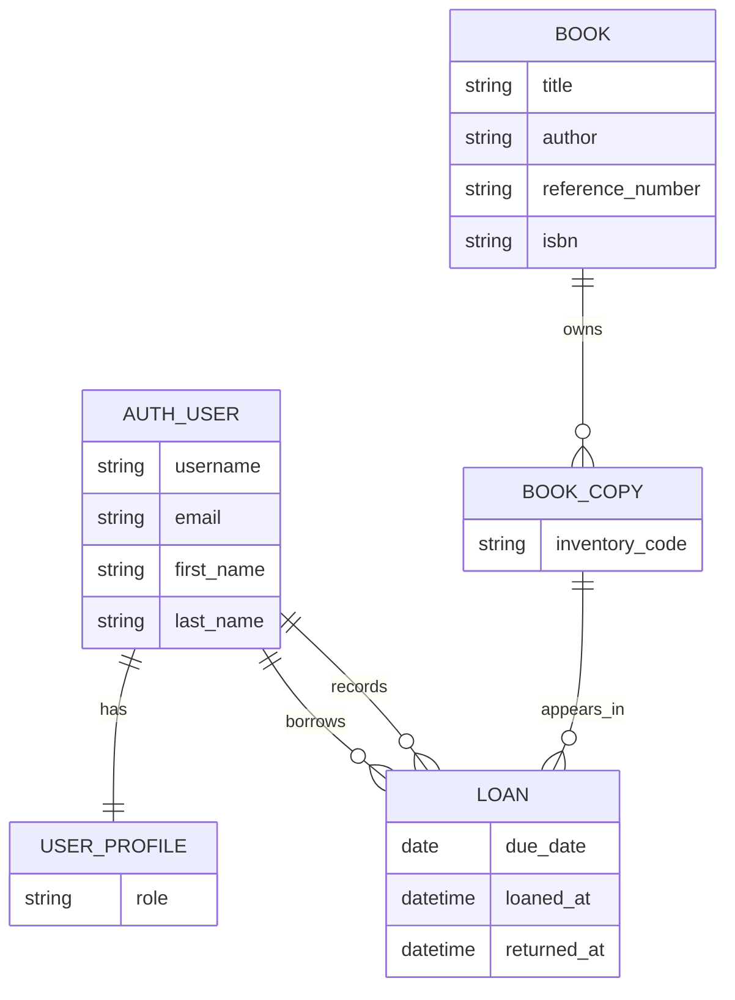
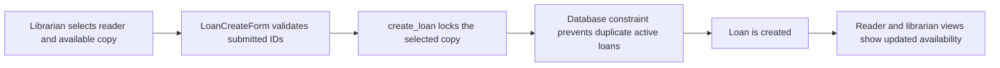

# Library Prototype

A Django prototype for a library desk system with separate reader and librarian
workflows. The project is intentionally small, but it is built as if it were the
first iteration of a maintainable production application: business rules are
centralized, access control is enforced server-side, data integrity is protected
by database constraints, deployment is reproducible, and the test suite covers
the important workflows.

## Demo Credentials

Reader:

- Username: `reader`
- Password: `ReaderDemo123!`

Librarian:

- Username: `librarian`
- Password: `LibrarianDemo123!`

## What The App Does

Readers can:

- Search the catalogue by title, author, internal reference number, or ISBN.
- See availability as available copies over total copies, for example `1/3`.
- View their own active loans and due dates.

Librarians can:

- Register a new loan using searchable reader and copy pickers.
- Register returns with a confirmation step.
- View active and overdue loans.
- View all active loans for a specific reader.
- Modify the due date of an active loan.
- Add, edit, and delete books, book copies, readers, and librarians.
- View all book copies or only available book copies.

## Engineering Quality Map

| Concern | Implementation | Evidence |
| --- | --- | --- |
| Robustness | Loan mutations are wrapped in transactions and lock rows before changing state. | `catalogue/services.py` |
| Data integrity | A conditional database constraint prevents two active loans for one copy. ISBNs, book reference numbers, and copy numbers are unique. | `catalogue/models.py` |
| Security | Role-based decorators protect reader and librarian pages. CSRF is enabled through Django. Production settings use secure cookies and HTTPS redirect when `DEBUG=false`. | `catalogue/permissions.py`, `library_project/settings.py` |
| Maintainability | The domain is split into models, forms, services, views, reusable templates, and static assets. Business rules do not live only in templates. | `catalogue/` |
| Usability | Large selections use search modals rather than dropdowns. Destructive or critical actions use confirmation or blocking rules. | `templates/catalogue/includes/search_picker.html`, `static/js/library-ui.js` |
| Extensibility | `Book` and `BookCopy` are separate so the catalogue can support multiple physical copies of one title. | `catalogue/models.py` |
| Deployment | Render Blueprint, PostgreSQL support, WhiteNoise static files, and a health endpoint are included. | `render.yaml`, `build.sh`, `library_project/health.py` |
| Quality assurance | Automated tests cover access control, loan lifecycle, validation, user management, search, deployment health, and UI rendering details. | `catalogue/tests/test_library_workflows.py`, `.github/workflows/ci.yml` |

## Architecture Overview

The core design separates the catalogue title from physical copies. A `Book`
represents bibliographic information such as title, author, ISBN, and the
library's internal reference number. A `BookCopy` represents a lendable physical
item with a globally unique copy number. A `Loan` links a reader to one copy
until the copy is returned.



The loan workflow deliberately passes through `catalogue/services.py` rather than
having each view update records directly.



## Codebase Tour

This section is the maintainability map for the project. It explains the main
files and folders so a reviewer can quickly see where each responsibility lives.

### Project Root

| Path | Purpose |
| --- | --- |
| `README.md` | Main project documentation, architecture notes, setup, tests, and deployment instructions. |
| `manage.py` | Standard Django command entry point for local development, tests, migrations, and management commands. |
| `requirements.txt` | Runtime and test dependencies: Django, Gunicorn, WhiteNoise, PostgreSQL URL parsing, PostgreSQL driver, and pytest. |
| `pytest.ini` | Connects pytest to `library_project.settings`. |
| `.python-version` | Pins the Python version for Render and CI. |
| `.github/workflows/ci.yml` | Runs Django checks, migration drift checks, static collection checks, and tests on push and pull request. |
| `.gitignore` | Keeps local databases, virtual environments, bytecode, collected static files, and test artifacts out of git. |
| `build.sh` | Render build script: installs dependencies and collects static files. |
| `render.yaml` | Render Blueprint for the web service and PostgreSQL database. |
| `Procfile` | Minimal process declaration for Procfile-compatible hosts. |

### Django Project: `library_project/`

| Path | Purpose |
| --- | --- |
| `settings.py` | Central configuration. It reads environment variables for secrets, host names, CSRF origins, debug mode, database URL, static files, and production security settings. |
| `urls.py` | Root URL configuration. It wires login/logout, admin, the health endpoint, and the `catalogue` app routes. |
| `health.py` | Lightweight deployment health endpoint. It verifies database connectivity with `SELECT 1` and returns `{"status": "ok"}`. |
| `wsgi.py` | WSGI entry point used by Gunicorn in deployment. |
| `asgi.py` | ASGI entry point retained for Django compatibility and future async deployment options. |
| `__init__.py` | Marks the directory as a Python package. |

### Application Package: `catalogue/`

| Path | Purpose |
| --- | --- |
| `models.py` | Domain model and query helpers. Defines roles, books, copies, loans, availability annotations, active loan filters, overdue logic, and database constraints. |
| `services.py` | Business-rule boundary for creating loans, returning loans, and changing due dates. Uses transactions and row locks to keep loan state consistent. |
| `forms.py` | User input validation and form presentation. Keeps create/edit validation close to the HTTP boundary. |
| `views.py` | Request handlers for reader pages, librarian pages, CRUD screens, search APIs, loan operations, and redirects. |
| `urls.py` | App-level URL map for catalogue, reader, librarian, book, copy, loan, and search API routes. |
| `permissions.py` | Role predicates and decorators. Readers and librarians are checked server-side before protected views run. |
| `password_validation.py` | Custom password validator requiring at least 8 characters, mixed case, a number, and a special character. |
| `admin.py` | Django admin registrations for inspecting and managing data during development. |
| `apps.py` | Django app configuration. |
| `management/commands/seed_demo.py` | Idempotent demo data command. Creates demo users, books, copies, and sample active loans. |
| `migrations/` | Versioned database schema history. Includes the initial schema, book reference/copy changes, and nullable reader history support. |
| `tests/test_library_workflows.py` | End-to-end style unit tests for the core workflows and edge cases. |

### Templates: `templates/`

| Path | Purpose |
| --- | --- |
| `base.html` | Shared page shell, navigation, theme switcher, messages, search modal, and confirmation modal. |
| `registration/login.html` | Login page for both readers and librarians. |
| `registration/signup.html` | Reader signup page, also used by librarians to create reader accounts. |
| `catalogue/catalogue.html` | Catalogue search results with availability counts and book detail links. |
| `catalogue/book_detail.html` | Book detail page with copy list and librarian management actions. |
| `catalogue/copy_detail.html` | Book copy detail page showing availability, active loan, and copy actions. |
| `catalogue/book_form.html` | Add/edit book form. Book creation supports initial copy codes. |
| `catalogue/book_copy_form.html` | Add/edit book copy form. |
| `catalogue/book_copies_list.html` | Librarian page for all copies or available copies, with search. |
| `catalogue/reader_loans.html` | Reader page for current loans and recent returned loans. |
| `catalogue/librarian_dashboard.html` | Librarian loans page with active and overdue filters. |
| `catalogue/librarian_reader_loans.html` | Librarian page focused on one reader's active and returned loans. |
| `catalogue/loan_form.html` | New loan form using searchable reader and copy pickers. |
| `catalogue/loan_due_date.html` | Due date edit form for active loans. |
| `catalogue/readers_list.html` | Reader account index and search page for librarians. |
| `catalogue/reader_form.html` | Reader account edit form. |
| `catalogue/librarians_list.html` | Librarian account index and search page. Marks the current user as `(myself)`. |
| `catalogue/librarian_form.html` | Add/edit librarian account form. |
| `catalogue/confirm_delete.html` | Reusable delete confirmation page. |
| `catalogue/includes/search_picker.html` | Reusable search-modal trigger used instead of large dropdowns. |
| `catalogue/includes/due_date.html` | Compact due date and days-left display. |
| `catalogue/includes/password_requirements.html` | Password requirement checklist shown while creating accounts. |
| `catalogue/includes/password_match.html` | Password confirmation checklist item. |

`catalogue/reader_dashboard.html` is retained as a simple reader-oriented
template from an earlier iteration. The current reader entry point redirects to
`reader_loans`, so this file can be reused or removed in a future cleanup.

### Static Assets: `static/`

| Path | Purpose |
| --- | --- |
| `static/css/styles.css` | Global styling, responsive layout, light/dark theme variables, tables, badges, forms, modals, and password checklist states. |
| `static/js/library-ui.js` | Progressive enhancement for theme switching, search modals, return confirmation, and live password checklist updates. |

## Important Implementation Details

### Loan Consistency

`create_loan`, `return_loan`, and `change_due_date` are transaction-wrapped.
`create_loan` locks the selected copy and checks for an existing active loan
before creating a new one. The `Loan` model also has a conditional unique
constraint named `one_active_loan_per_copy`, which gives a second line of
defense at the database level.

### Reader Deletion And Loan History

Loans keep their historical record even if a reader account is deleted. The
`Loan.reader` foreign key is nullable and uses `SET_NULL`, so returned-loan
history remains available without blocking account cleanup after active loans are
resolved.

### Search And Selection

Catalogue and management pages use simple case-insensitive search, which is
appropriate for a prototype and easy to inspect. New-loan selection uses API
search endpoints and modal pickers instead of dropdowns so the UI remains usable
when the number of readers or copies grows.

### Password Policy

The custom validator in `catalogue/password_validation.py` enforces a practical
demo policy: at least 8 characters with lowercase, uppercase, numeric, and
special characters. The same rule is shown live in the UI with red/green
checklist states.

### Production Settings

When `DEBUG=false`, the app enables WhiteNoise's compressed manifest storage,
secure session and CSRF cookies, HTTPS redirect, HSTS, and proxy SSL handling.
Secrets and deployment-specific host names are read from environment variables.

## Local Setup

```bash
python3 -m venv .venv
. .venv/bin/activate
pip install -r requirements.txt
python manage.py migrate
python manage.py seed_demo --reset
python manage.py runserver
```

Open `http://127.0.0.1:8000`.

Health check:

```bash
curl http://127.0.0.1:8000/health/
```

Expected response:

```json
{"status": "ok"}
```

## Tests And Quality Checks

Run the full test suite:

```bash
pytest
```

Recommended local verification before pushing:

```bash
python manage.py check
python manage.py makemigrations --check --dry-run
python manage.py collectstatic --dry-run --noinput
pytest
```

The test suite covers:

- Reader access limited to the reader's own loans.
- Librarian-only page protection.
- Loan creation, duplicate active-loan prevention, returns, and due date edits.
- Overdue loan visualization.
- Catalogue and copy availability counts.
- Search APIs and searchable management pages.
- Reader and librarian account creation, editing, deletion rules, and unique email validation.
- Book, book-copy, ISBN, reference number, and copy-number validation.
- Password policy rendering.
- Deployment health check.

The GitHub Actions workflow in `.github/workflows/ci.yml` runs the same core
checks automatically on push and pull request.

## Deployment

The project is ready for Render using the committed `render.yaml` Blueprint.
The Blueprint provisions a Python web service and a private PostgreSQL database,
generates a `SECRET_KEY`, and uses the free-tier compatible start command to run
migrations, ensure demo data exists, and start Gunicorn.

1. Push this repository to GitHub.
2. In Render, choose **New > Blueprint** and connect the GitHub repository.
3. Select the `main` branch and deploy the root `render.yaml`.
4. After deployment, open the generated `*.onrender.com` URL.

The Blueprint sets:

- `DEBUG=false`
- `SECRET_KEY` generated by Render
- `DATABASE_URL` from the Render PostgreSQL database
- `ALLOWED_HOSTS=.onrender.com`
- `CSRF_TRUSTED_ORIGINS=https://*.onrender.com`

Manual service setup is also possible:

```bash
./build.sh
python manage.py migrate
python manage.py seed_demo
gunicorn library_project.wsgi
```

## Known Limitations And Sensible Next Steps

This is a prototype, so a few choices are intentionally simple:

- Search uses `icontains` filters rather than PostgreSQL full-text search.
- Lists are not paginated yet.
- There is no email verification or password reset email flow.
- There is no audit-log table beyond the loan metadata fields.
- The Render free-tier start command runs migrations at startup. For a paid or
  production service, migrations should move back to a pre-deploy step.
- There is no API authentication layer because the current app is server-rendered.

Good next engineering steps would be pagination, full-text search, an audit log,
explicit service-level tests for concurrent loan creation, and a small amount of
template cleanup around legacy reader-dashboard naming.
